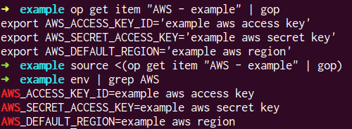

[](https://goreportcard.com/report/github.com/ckhrysze/gop)
[](https://travis-ci.org/ckhrysze/gop)

# GOP

Welcome to the GOP repo! This was a quick experiment to see if I could set the needed AWS environment variables for terraform from the 1password CLI client. As it turns out, it was quite straight forward.

### Usage



### Installation

I haven't gotten that far yet. Well, builds anyway. I just `go build -o gop` and mv the executable to my PATH somewhere.

### Notes

I'm still learning idiomatic go, but one of the reasons I setup the variables like I did was to allow building with whatever naming scheme one desired. I haven't confirmed this yet, but

```
go build -ldflags "-X main.SectionName=<section> main.AccessField=<access key field name> main.SecretField=<secret field name> main.RegionField=<region field name>" -o gop
```

should work.

### TODO

Learn about Go Releaser and prove that the ldflags works as intended.